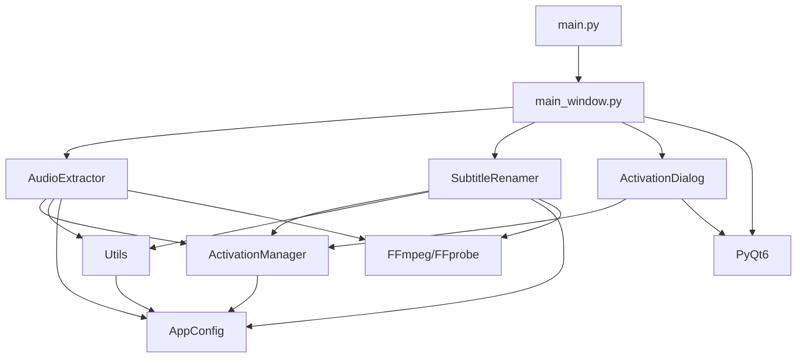

# 🔧 开发者文档

## 📐 项目架构

### 整体架构设计

```
┌─────────────────────────────────────┐
│             主应用程序              │
│          (main_window.py)          │
├─────────────────────────────────────┤
│             用户界面层              │
│    ┌─────────────┬─────────────┐    │
│    │  音频提取   │  字幕重命名 │    │
│    │    标签页   │    标签页   │    │
│    └─────────────┴─────────────┘    │
├─────────────────────────────────────┤
│             业务逻辑层              │
│  ┌─────────────┬─────────────────┐  │
│  │ 音频提取器  │   字幕重命名器  │  │
│  │(AudioExtractor)│(SubtitleRenamer)│  │
│  └─────────────┴─────────────────┘  │
├─────────────────────────────────────┤
│             通用服务层              │
│  ┌─────────┬─────────┬─────────┐   │
│  │激活管理 │工具函数 │配置管理 │   │
│  └─────────┴─────────┴─────────┘   │
├─────────────────────────────────────┤
│             底层依赖层              │
│      FFmpeg/FFprobe + PyQt6        │
└─────────────────────────────────────┘
```

### 模块依赖关系



## 🏗️ 代码结构详解

### 核心模块说明

#### 1. 主应用程序 (`src/main_window.py`)
```python
class MainWindow(QMainWindow):
    """主应用程序窗口
    
    职责：
    - 整合音频提取和字幕重命名功能
    - 管理标签页界面
    - 处理用户交互
    - 协调各功能模块
    """
```

**关键方法**：
- `create_audio_extractor_tab()` - 创建音频提取界面
- `create_subtitle_renamer_tab()` - 创建字幕重命名界面
- `start_audio_extraction()` - 启动音频提取流程
- `scan_subtitles()` - 扫描字幕文件

#### 2. 音频提取器 (`modules/audio_extractor/extractor.py`)
```python
class AudioExtractor(QThread):
    """音频提取工作线程
    
    职责：
    - 扫描视频文件
    - 分析音频流信息
    - 执行音频提取和转码
    - 报告处理进度
    """
```

**核心功能**：
- `scan_video_files()` - 扫描视频文件
- `get_audio_info()` - 获取音频流信息
- `detect_channel_volumes()` - 检测伪立体声
- `extract_audio()` - 提取音频文件
- `convert_to_mp3()` - 转码为MP3

#### 3. 字幕重命名器 (`modules/subtitle_renamer/renamer.py`)
```python
class SubtitleRenamer:
    """字幕重命名器
    
    职责：
    - 扫描视频和字幕文件
    - 执行智能匹配算法
    - 生成重命名计划
    - 执行批量重命名
    """
```

**匹配算法**：
- `extract_episode_tokens()` - 提取剧集编号
- `build_plan()` - 构建重命名计划
- `execute_plan()` - 执行重命名
- `undo_last_operation()` - 撤销操作

#### 4. 激活管理器 (`modules/common/activation.py`)
```python
class ActivationManager:
    """激活管理器
    
    职责：
    - 验证激活码
    - 保存激活状态
    - 检查激活状态
    - 处理权限问题
    """
```

### 配置系统 (`config/app_config.py`)

#### 应用配置
```python
# 应用基本信息
APP_NAME = "视频处理工具集"
APP_VERSION = "2.0.0"

# 支持的文件格式
VIDEO_EXTENSIONS = {'.mp4', '.avi', '.mkv', ...}
SUBTITLE_EXTENSIONS = {'.srt', '.ass', '.ssa', ...}
AUDIO_EXTENSIONS = {'.mp3', '.wav', '.m4a', ...}

# 处理参数
MAX_FILE_SIZE_MB = 500
DEFAULT_THREADS = 4
MAX_THREADS = 32
```

#### 路径管理
```python
def get_app_root() -> Path:
    """获取应用根目录"""
    
def get_bin_path() -> Path:
    """获取二进制文件目录"""
    
def get_resources_path() -> Path:
    """获取资源文件目录"""
```

## 🎨 UI设计系统

### 样式架构 (`ui/styles/app_style.py`)

#### 颜色系统
```python
COLORS = {
    'primary': '#007AFF',           # 主色调
    'primary_hover': '#0056CC',     # 悬停色
    'background': '#ffffff',        # 背景色
    'text': '#1a1a1a',            # 文本色
    'border': '#d0d7de',          # 边框色
    'success': '#2da44e',         # 成功色
    'warning': '#ffd666',         # 警告色
    'error': '#da3633',           # 错误色
}
```

#### 组件样式
- **按钮系统**：主要按钮、次要按钮、危险按钮
- **输入控件**：文本框、复选框、数值输入
- **容器组件**：组框、标签页、表格
- **反馈组件**：进度条、消息框、状态栏

### 响应式设计

#### 窗口尺寸适配
```python
# 最小尺寸
self.setMinimumSize(1000, 700)
# 默认尺寸  
self.resize(1000, 800)
```

#### 布局管理
- **垂直布局**：主要内容区域
- **水平布局**：工具栏和按钮组
- **网格布局**：复杂表单
- **拉伸布局**：自适应空间分配

## 🔄 数据流设计

### 音频提取数据流

```
用户选择文件夹
      ↓
扫描视频文件
      ↓
分析音频流信息
      ↓
检测伪立体声
      ↓
确定输出格式
      ↓
创建工作队列
      ↓
多线程处理
      ↓
进度更新
      ↓
完成回调
```

### 字幕重命名数据流

```
用户选择文件夹
      ↓
扫描视频和字幕
      ↓
提取剧集信息
      ↓
执行匹配算法
      ↓
生成重命名计划
      ↓
用户确认
      ↓
执行重命名
      ↓
记录操作日志
```

## 🔧 关键算法实现

### 伪立体声检测算法

```python
def detect_channel_volumes(self, video_file: Path, stream_index: int) -> Tuple[float, float, str]:
    """检测左右声道音量"""
    # 1. 使用FFmpeg astats滤镜分析
    # 2. 解析左右声道RMS音量
    # 3. 计算音量差异
    # 4. 判断音频类型
    
    volume_diff = abs(left_rms - right_rms)
    silent_threshold = -50.0
    significant_diff = 15.0
    
    if left_rms < silent_threshold and right_rms >= silent_threshold:
        return left_rms, right_rms, "pseudo_stereo_right"
    elif right_rms < silent_threshold and left_rms >= silent_threshold:
        return left_rms, right_rms, "pseudo_stereo_left"
    elif volume_diff > significant_diff:
        return left_rms, right_rms, "pseudo_stereo_left" if left_rms > right_rms else "pseudo_stereo_right"
    else:
        return left_rms, right_rms, "true_stereo"
```

### 智能匹配算法

```python
def build_plan(self, videos: List[FileItem], subs: List[FileItem]) -> List[PlanRow]:
    """构建重命名计划"""
    # 1. 按剧集编号分组视频
    # 2. 优先剧集编号匹配
    # 3. 模糊文件名匹配
    # 4. 可选时长验证
    
    for s in subs:
        # 剧集编号匹配
        for ep in s.episodes:
            if ep in video_by_episode:
                candidates = video_by_episode[ep]
                # 同目录优先 + 相似度排序
                candidates_sorted = sorted(candidates, key=lambda v: (
                    0 if v.path.parent == s.path.parent else 1,
                    -fuzz.ratio(v.stem, s.stem)
                ))
                matched = candidates_sorted[0]
                break
        
        # 模糊匹配
        if not matched:
            best_score = -1
            for v in videos:
                score = fuzz.token_set_ratio(v.stem, s.stem)
                if v.path.parent == s.path.parent:
                    score += 5  # 同目录加成
                if score > best_score and score >= 60:
                    best_score, matched = score, v
```

## 🧵 并发处理设计

### 多线程架构

```python
class AudioExtractor(QThread):
    """主工作线程"""
    
    def run(self):
        # 创建任务队列
        task_queue = Queue()
        
        # 创建工作线程池
        threads = []
        for i in range(self.max_threads):
            thread = threading.Thread(target=self._worker_thread, args=(task_queue,))
            thread.daemon = True
            threads.append(thread)
            thread.start()
        
        # 等待所有线程完成
        for thread in threads:
            thread.join()
```

### 线程安全机制

```python
# 使用QMutex保护共享资源
self.mutex = QMutex()

def update_progress(self):
    self.mutex.lock()
    try:
        self.processed_files += 1
        progress = int((self.processed_files / self.total_files) * 100)
        self.progress_updated.emit(progress)
    finally:
        self.mutex.unlock()
```

### 进程管理

```python
def stop(self):
    """停止处理"""
    self.is_stopped = True
    
    # 终止所有活跃的子进程
    for process in self.active_processes:
        try:
            if process.poll() is None:
                process.terminate()
                process.wait(timeout=3)
        except subprocess.TimeoutExpired:
            process.kill()
```

## 📊 性能优化策略

### 内存优化

1. **流式处理**：避免一次性加载大文件
2. **对象池**：重用临时对象
3. **及时释放**：处理完毕立即释放资源
4. **分页加载**：大量文件分批处理

### IO优化

1. **异步操作**：使用异步文件操作
2. **批量处理**：合并小文件操作
3. **缓存策略**：缓存文件信息
4. **预读取**：提前读取下一个文件

### CPU优化

1. **多线程并行**：充分利用多核CPU
2. **任务分配**：平衡各线程负载
3. **算法优化**：优化关键算法
4. **避免阻塞**：减少UI线程阻塞

## 🛡️ 错误处理机制

### 分层错误处理

```python
# 1. 底层错误捕获
try:
    result = subprocess.run(cmd, ...)
except subprocess.TimeoutExpired:
    return ProcessResult(success=False, error_msg="处理超时")
except Exception as e:
    return ProcessResult(success=False, error_msg=str(e))

# 2. 业务层错误处理
def extract_audio(self, video_file: Path) -> ProcessResult:
    try:
        # 具体业务逻辑
        pass
    except Exception as e:
        self.log_error(f"处理文件失败: {video_file}, 错误: {e}")
        return ProcessResult(success=False, ...)

# 3. UI层错误展示
def on_file_processed(self, result: ProcessResult):
    if not result.success:
        self.log_message(f"失败：{result.error_msg}")
```

### 恢复机制

1. **自动重试**：网络和IO错误自动重试
2. **跳过错误**：单个文件错误不影响整体
3. **状态保存**：保存处理状态支持恢复
4. **用户反馈**：详细的错误信息和建议

## 🔬 测试策略

### 单元测试

```python
# tests/test_audio_extractor.py
class TestAudioExtractor(unittest.TestCase):
    def setUp(self):
        self.extractor = AudioExtractor(...)
    
    def test_scan_video_files(self):
        """测试视频文件扫描"""
        files = self.extractor.scan_video_files()
        self.assertGreater(len(files), 0)
    
    def test_detect_channel_volumes(self):
        """测试声道检测"""
        left, right, audio_type = self.extractor.detect_channel_volumes(...)
        self.assertIn(audio_type, ['true_stereo', 'pseudo_stereo_left', ...])
```

### 集成测试

```python
# tests/test_integration.py
class TestIntegration(unittest.TestCase):
    def test_full_audio_extraction_workflow(self):
        """测试完整音频提取流程"""
        # 1. 创建测试文件
        # 2. 执行提取
        # 3. 验证结果
        # 4. 清理测试文件
```

### 性能测试

```python
def test_performance_large_batch(self):
    """测试大批量处理性能"""
    start_time = time.time()
    # 处理1000个文件
    elapsed = time.time() - start_time
    self.assertLess(elapsed, 300)  # 应在5分钟内完成
```

## 📦 构建和部署

### 开发环境搭建

```bash
# 1. 克隆项目
git clone <repository-url>
cd refactor_project

# 2. 创建虚拟环境
python -m venv venv
source venv/bin/activate  # Linux/Mac
venv\Scripts\activate     # Windows

# 3. 安装依赖
pip install -r requirements.txt

# 4. 运行测试
python -m pytest tests/

# 5. 启动应用
python main.py
```

### 打包部署

```bash
# 使用PyInstaller打包
pyinstaller --windowed --onefile main.py

# 创建安装包（需要额外配置）
makensis installer.nsi
```

### 版本管理

```python
# config/app_config.py
APP_VERSION = "2.0.0"

# 版本号规则：主版本.次版本.修订版本
# 主版本：重大功能变更
# 次版本：新功能添加
# 修订版本：错误修复
```

## 🔧 扩展开发指南

### 添加新功能模块

1. **创建模块目录**：`modules/new_feature/`
2. **实现核心类**：继承适当的基类
3. **添加UI界面**：在主窗口添加标签页
4. **注册信号槽**：连接UI和业务逻辑
5. **更新配置**：添加相关配置项
6. **编写测试**：添加单元测试和集成测试

### 自定义样式主题

```python
# ui/styles/custom_theme.py
CUSTOM_COLORS = {
    'primary': '#your_color',
    'background': '#your_background',
    # ...
}

CUSTOM_STYLE = f"""
/* 你的自定义样式 */
QPushButton {{
    background-color: {CUSTOM_COLORS['primary']};
}}
"""
```

### 插件化扩展

```python
# 插件接口
class PluginInterface:
    def get_name(self) -> str:
        """获取插件名称"""
        pass
    
    def get_widget(self) -> QWidget:
        """获取插件界面"""
        pass
    
    def process(self, input_data) -> Any:
        """处理业务逻辑"""
        pass
```

---

如需了解更多技术细节，请参考源代码注释或联系开发团队。

